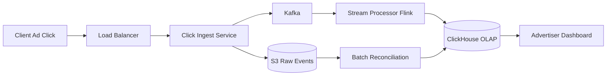

# Ad Click Aggregator

### 1. Requirements
**Functional**
- Ingest ad click events at massive volume.
- Aggregate clicks into time windows (e.g. per-minute) per ad/campaign.
- Serve aggregated metrics to an advertiser dashboard with arbitrary group-bys.

**Non-functional**
- Billing-grade correctness: handle late, out-of-order, and duplicate events; no double-billing.
- Durability of raw events (replayable) and exactly-once aggregation.
- Low-latency dashboard reads; near-real-time freshness (seconds-to-minute lag acceptable).
- Scale: 10K-1M+ clicks/sec, billions of events/day.

### 2. Core Entities
- **Click Event** — a single billable click with ad ID, timestamp, dedup/click ID.
- **Ad / Campaign** — the entity clicks are attributed to.
- **Aggregate** — a windowed count (clicks per ad per minute).
- **Window** — an event-time bucket with a watermark.

### 3. API
```
POST /clicks                { ad_id, click_id, ts, user, ... } -> 202
GET  /ads/{id}/metrics?from=..&to=..&granularity=minute -> [ {window, clicks} ]
GET  /campaigns/{id}/metrics?group_by=ad -> [ ... ]
```

### 4. High-Level Design


**Components**
- **Click Ingest Service** — validates clicks, attaches a click/impression ID, and writes to Kafka and raw S3. *Why here:* clicks are billable events at massive volume; ingestion must be cheap, durable, and emit a dedup key so the same click isn't billed twice.
- **Kafka** — durable, ordered, partitioned (by ad ID) log decoupling ingest from processing with replay. *Why here:* it lets the slow aggregator fall behind or crash without dropping billable events, and replay is the recovery mechanism when the stream job fails.
- **Stream Processor (Flink)** — event-time tumbling windows (e.g. 1 min) with watermarks for late events, stateful dedup, and exactly-once checkpointing to S3. *Why here:* ad spend must be correct despite out-of-order/late and duplicate clicks; event-time windows + watermarks + exactly-once state are precisely what makes per-minute counts trustworthy and billing-grade.
- **ClickHouse OLAP** — stores aggregated rows for fast slice-and-dice analytical queries. *Why here:* advertisers query "clicks by campaign over time" with arbitrary group-bys; a columnar OLAP store serves these orders of magnitude faster than the transactional path.
- **S3 Raw Events** — immutable landing zone for every raw click. *Why here:* the real-time path optimizes for speed and can be wrong; raw events enable a recomputed ground truth.
- **Batch Reconciliation** — periodically recomputes aggregates from raw S3 and corrects the OLAP store. *Why here:* this lambda-style backstop catches stream errors/dropped events so billed totals eventually match reality.
- **Advertiser Dashboard** — reads aggregates from OLAP. *Why here:* it's the consumer the windowing and OLAP choices exist to serve.

Click events are captured by the Ingest Service, which validates them, attaches a dedup key, and writes to both Kafka (partitioned by ad ID) and raw S3. The Flink Stream Processor consumes Kafka, deduplicates, and runs event-time windowed aggregation, writing results to ClickHouse for fast dashboard queries. Raw events in S3 feed a periodic Batch Reconciliation job that recomputes ground truth and corrects the OLAP store.

### 5. Deep Dives
- **Stream processing with event-time windows** — ad spend must be correct despite out-of-order and late clicks. Flink uses event-time tumbling windows with watermarks so a click is counted in the window it actually happened, not when it arrived. Tradeoff: must hold window state and wait for watermarks, adding bounded latency before a window finalizes.
- **Dedup** — the same click can arrive twice; without dedup it's billed twice. Each event carries a click/impression ID and the stream processor keeps stateful dedup keyed on it. Tradeoff: dedup state grows with cardinality and must be bounded by a time horizon.
- **Exactly-once + reconciliation** — Flink checkpoints to S3 for exactly-once processing, but the real-time path can still drift. A lambda-style batch job recomputes aggregates from immutable raw S3 events and corrects ClickHouse. Tradeoff: dual code paths (stream + batch) to maintain, in exchange for billing-accurate eventual totals.
- **OLAP serving** — advertisers slice by campaign/time with arbitrary group-bys; a columnar store (ClickHouse) serves these orders of magnitude faster than the transactional path. Tradeoff: pre-aggregated rows trade some query flexibility for speed.

