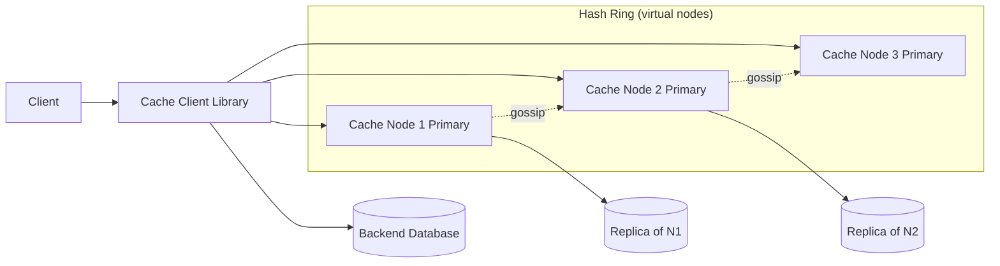

# Distributed Cache

### 1. Requirements
**Functional**
- GET/SET/DELETE key-value pairs with single-digit-ms latency.
- Optional TTL/expiry per key.
- Scale horizontally by adding nodes with minimal disruption.

**Non-functional**
- High availability: survive node failures without losing the whole keyspace.
- Even key distribution; handle hot keys and the cache-miss stampede.
- Low latency on the hot path (avoid extra hops).
- Eventual consistency acceptable (cache is non-authoritative); millions of ops/sec.

### 2. Core Entities
- **Key/Value** — the cached entry, optionally with TTL.
- **Cache Node** — an in-memory KV store owning a slice of the keyspace.
- **Hash Ring** — the consistent-hashing ring mapping keys to nodes (with virtual nodes).
- **Replica** — a copy of a node's shard on its successor.
- **Backend DB** — the system of record behind the cache.

### 3. API
```
GET    /cache/{key}                 -> { value } | 404 (miss)
PUT    /cache/{key}                 -> 200
       body: { value, ttlSeconds }
DELETE /cache/{key}                 -> 204
```
(Client-library SDK form: `get(key)`, `set(key, value, ttl)`, `delete(key)`)

### 4. High-Level Design



**Components**
- **Cache Client Library** — does the consistent-hash routing on the client side (smart client). *Why here:* avoids a central router/proxy hop on the hot path; the client computes the node directly for single-digit-ms latency.
- **Hash Ring with Virtual Nodes** — keys and nodes placed on a ring; each physical node owns many virtual points. *Why here:* adding/removing a node remaps only ~1/N of keys (not the whole keyspace as with mod-hashing), and virtual nodes smooth out hot/cold imbalance.
- **Primary Cache Nodes** — in-memory key-value stores serving GET/SET with eviction (LRU/LFU). *Why here:* the entire point is RAM-speed lookups to shield the backend DB from read load.
- **Replicas (successor ring)** — copy of each primary on the next node clockwise. *Why here:* a node crash would otherwise lose its whole shard and stampede the DB; the replica can take over the keyspace.
- **Gossip Protocol** — peer-to-peer dissemination of membership and failure detection. *Why here:* with no central registry, nodes must converge on who's alive and who owns what so routing stays consistent as the cluster changes.
- **Backend Database** — system of record behind the cache. *Why here:* cache is non-authoritative; misses and writes (write-through/back) must reach durable storage.

The smart client library hashes the key onto the consistent-hashing ring to compute the owning node directly (no central proxy hop), then reads/writes there. On a miss it falls through to the backend DB and populates the cache. Each node asynchronously replicates its shard to its successor on the ring, and nodes gossip membership/failure so routing stays correct as the cluster changes.

### 5. Deep Dives
- **Consistent hashing + virtual nodes** — Plain mod-hashing remaps the entire keyspace when a node is added/removed. A hash ring remaps only ~1/N of keys, and assigning each physical node many virtual points smooths hot/cold imbalance. Tradeoff: more bookkeeping and slightly more complex routing than mod-hashing.
- **Eviction policy** — Memory is bounded, so the cache must evict (LRU/LFU). LRU is cheap and good for recency-skewed traffic; LFU better protects frequently-hit keys. Tradeoff: LFU needs frequency counters and can keep stale-but-once-popular keys.
- **Replication & failover** — Each primary's shard is copied to the next node clockwise so a crash doesn't lose the whole shard and stampede the DB; the replica takes over the keyspace. Tradeoff: async replication risks losing the last few writes on failover.
- **Hot keys & stampede** — A few keys (a viral item) can overload one node; mitigate with key replication/fan-out and request coalescing plus locks or stale-while-revalidate so a single expiry doesn't send a thundering herd to the DB.
- **Membership via gossip** — With no central registry, nodes use peer-to-peer gossip for failure detection and membership convergence so the ring stays consistent; tradeoff is eventual (not instant) convergence.

