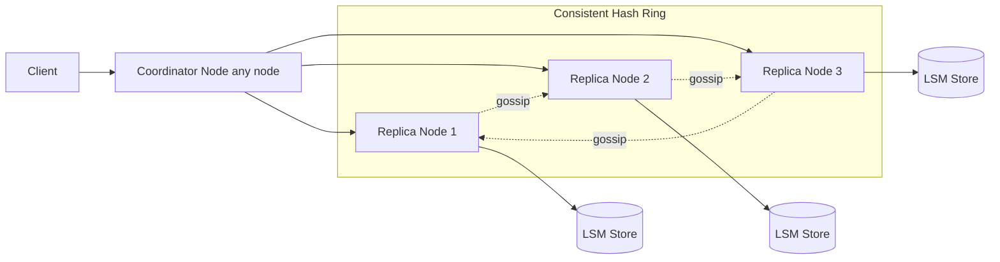

# Distributed Key-Value Store (like DynamoDB)

### 1. Requirements
**Functional**
- get(key) and put(key, value).
- Scale storage and throughput horizontally by adding nodes.
- Survive node and network-partition failures while staying writable.

**Non-functional**
- High availability ("always writable") and partition tolerance (AP-leaning).
- Tunable consistency via quorums; low and predictable latency.
- Incremental scalability with no downtime when adding/removing nodes.
- Scale: petabytes across thousands of nodes; single-digit-ms reads/writes.

### 2. Core Entities
- **Key / Value** — the stored item.
- **Node** — a peer in the ring; any node can coordinate.
- **Preference List** — the N replica nodes responsible for a key.
- **Vector Clock** — version metadata on a value for conflict detection.

### 3. API
```
PUT /keys/{key}   { value, context }     -> { version }
GET /keys/{key}   -> { value(s), context }   (may return siblings)
DELETE /keys/{key}
```

### 4. High-Level Design


**Components**
- **Coordinator Node (any node)** — the node that receives the request routes it to the key's replicas and gathers the quorum. *Why here:* Dynamo is intentionally decentralized — there is no master, so any node can coordinate, which removes the single point of failure and lets the cluster stay available.
- **Consistent Hash Ring** — maps keys and nodes onto a ring so each key owns N successor replicas (its preference list). *Why here:* it gives incremental scalability — adding/removing a node only reshuffles keys with its immediate neighbors, essential for a store meant to grow without downtime.
- **Replica Nodes + Quorum (R + W > N)** — N copies per key with tunable read/write quorums. *Why here:* the R+W>N overlap is what lets operators dial the consistency/latency/availability tradeoff per workload, the defining knob of a Dynamo-style store.
- **LSM Store** — local on-disk engine optimized for high write throughput. *Why here:* a KV store must absorb heavy writes with low latency; log-structured merge trees turn random writes into sequential ones.
- **Gossip protocol** — peers periodically exchange membership and node-liveness state. *Why here:* with no central registry, decentralized failure detection and ring membership must propagate peer-to-peer to preserve the symmetric, masterless design.
- **Vector clocks / version reconciliation (off-diagram detail)** — each value carries a vector clock so concurrent writes are detected and reconciled (last-writer-wins or app-level merge). *Why here:* an always-writable, eventually-consistent store inevitably produces conflicting versions during partitions; vector clocks are how those divergent versions are identified and merged.
- **Hinted handoff / read repair (off-diagram detail)** — temporary replicas hold writes for down nodes and stale replicas are fixed on read. *Why here:* these sustain the "always writable" guarantee and converge replicas after failures heal.

A client request reaches any node, which acts as coordinator. The coordinator uses consistent hashing to find the key's N preference-list replicas and applies quorum reads/writes (R + W > N) against their local LSM stores. Membership, version reconciliation, and failure detection propagate peer-to-peer via gossip, so there is no master and no single point of failure.

### 5. Deep Dives
- **Consistent hashing** — keys and nodes sit on a ring so each key owns its N successor replicas; adding/removing a node only reshuffles keys with its immediate neighbors. Virtual nodes smooth load imbalance. Tradeoff: routing must track ring membership (via gossip), and rebalancing moves data.
- **Quorum (R + W > N)** — tunable read/write quorums let operators dial consistency vs. latency vs. availability per workload; R + W > N guarantees read/write overlap. Tradeoff: higher R or W means stronger consistency but higher latency and lower availability under failure.
- **Vector clocks** — an always-writable store under partitions inevitably produces conflicting versions. Each value carries a vector clock so concurrent writes are detected and reconciled (last-writer-wins or app-level merge / sibling resolution). Tradeoff: clients may receive multiple versions to merge, pushing complexity to the application.
- **Hinted handoff + read repair** — when a replica is down, a temporary node holds its writes (hint) and forwards them on recovery; stale replicas are fixed on read. Tradeoff: sustains the "always writable" guarantee and converges replicas, at the cost of transient inconsistency until repair completes.

