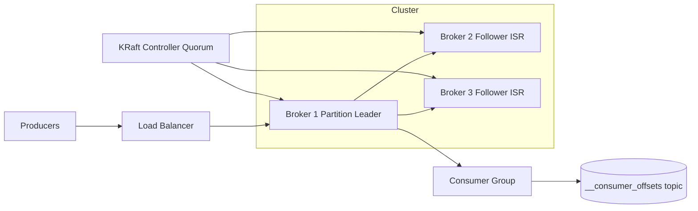

# Distributed Message Queue

### 1. Requirements
**Functional**
- Producers publish messages to a named topic; consumers subscribe and read them.
- Messages within a partition are delivered in order.
- Consumers in a group share partitions and resume from their last committed offset after restart.

**Non-functional**
- Durability / no data loss on broker failure (replication).
- High throughput: millions of messages/sec via sequential disk writes.
- Horizontal scalability by adding partitions/brokers.
- Configurable delivery semantics (at-least-once / exactly-once); strongly consistent metadata.

### 2. Core Entities
- **Topic** — a named logical stream, split into partitions.
- **Partition** — an ordered, append-only log; the unit of parallelism and ordering.
- **Message/Record** — a key/value record with an offset within its partition.
- **Broker** — a node hosting partition replicas (leader or follower).
- **Consumer Group** — a set of consumers sharing a topic's partitions.
- **Offset** — a consumer group's committed read position per partition.

### 3. API
```
POST /topics/{topic}/messages              -> { partition, offset }
     body: { key, value }
GET  /topics/{topic}/partitions/{p}/poll?group=&maxBytes=  -> [Message]
POST /groups/{group}/offsets/commit        -> 200
     body: { topic, partition, offset }
POST /admin/topics                          -> create topic { name, partitions, replicationFactor }
```

### 4. High-Level Design



**Components**
- **Producers** — append records, choosing partition by key hash or round-robin. *Why here:* key-based partitioning is what gives per-key ordering and lets the same key always land on the same partition.
- **Partition Leader (Broker 1)** — owns all reads/writes for a partition, an append-only log on disk. *Why here:* a single writer per partition is how the queue gets total ordering and high sequential-write throughput.
- **Followers / ISR (Brokers 2-3)** — replicate the leader's log; only in-sync replicas can be elected leader. *Why here:* a message is only committed once all ISR have it, giving durability and zero data loss on broker failure.
- **KRaft Controller Quorum** — Raft-based metadata store for topics, partitions, leader assignment, and broker liveness (replaces ZooKeeper). *Why here:* leader election and membership need a strongly consistent coordinator; KRaft folds that into the cluster itself.
- **Consumer Group** — partitions are divided across consumers; each partition read by one consumer in the group. *Why here:* this is how throughput scales horizontally while preserving per-partition order.
- **__consumer_offsets topic** — durable store of each group's committed offset per partition. *Why here:* consumer progress must survive consumer restarts and rebalances so processing resumes exactly where it left off; storing offsets as a log gives the same durability as the data.

A producer hashes the message key to a partition and appends to that partition's leader broker, which replicates to its in-sync follower replicas (ISR) before acking. The KRaft controller quorum holds cluster metadata (topics, partition leadership, broker liveness) using Raft. A consumer group pulls in order from each partition leader and commits per-partition progress to the durable `__consumer_offsets` topic.

### 5. Deep Dives
- **Partitioning & ordering** — A single leader per partition is what gives total ordering and high sequential-write throughput; key-hash partitioning guarantees the same key always lands on the same partition (per-key ordering). Tradeoff: ordering is only per-partition, not global, and a hot key can skew one partition.
- **Replication & leader election** — A message is committed only once all ISR have it, giving zero data loss; only an in-sync replica can be elected leader. KRaft (Raft-based controller quorum) provides the strongly consistent coordinator for membership and leader election, replacing ZooKeeper. Tradeoff: requiring full-ISR acks trades latency for durability (tunable via acks).
- **Consumer offsets & delivery semantics** — Offsets are stored as a durable log so progress survives restarts and rebalances. The ordering of offset-commit vs. message processing decides the semantics: commit-after-process = at-least-once (possible reprocessing); transactional commits = exactly-once. Tradeoff: exactly-once adds coordination overhead.
- **Consumer group rebalancing** — Each partition is read by exactly one consumer in a group; when members join/leave, partitions are reassigned. This scales throughput horizontally while preserving per-partition order, at the cost of brief stop-the-world rebalances.

