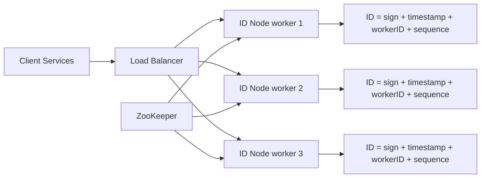

# Distributed Unique ID Generator (like Snowflake)

### 1. Requirements
**Functional**
- Generate globally unique 64-bit IDs.
- IDs should be roughly time-sortable (k-sorted).
- No central bottleneck on the ID-generation path.

**Non-functional**
- Extremely high throughput (millions of IDs/sec across the fleet) and very low latency (no per-ID network round trip).
- High availability; the generator must not be a single point of failure.
- Uniqueness must hold absolutely, including across node restarts and clock anomalies.
- Scale: 12-bit sequence = 4096 IDs per node per millisecond, 10-bit worker = 1024 nodes.

### 2. Core Entities
- **ID** — a 64-bit integer: 1 sign + 41 timestamp + 10 worker ID + 12 sequence.
- **ID Node (worker)** — a stateless generator holding a unique worker ID.
- **Worker ID lease** — the distinct ID assigned to each node by the coordinator.
- **Sequence counter** — per-node, per-millisecond counter.

### 3. API
```
GET /id            -> { id: 1234567890123456789 }
GET /ids?count=100 -> { ids: [ ... ] }   (batch)
```

### 4. High-Level Design


**Components**
- **ID Node (worker)** — packs the current millisecond timestamp, its worker ID, and a per-millisecond sequence counter into a single 64-bit integer (1 sign + 41 timestamp + 10 worker + 12 sequence). *Why here:* the whole point is generating roughly time-sortable unique IDs at memory speed; doing it locally per node is what removes the central bottleneck a ticket server would impose.
- **ZooKeeper** — leases each node a distinct worker ID at boot via leader election / ephemeral nodes and detects node death. *Why here:* uniqueness rests entirely on no two live nodes sharing a worker ID; ZooKeeper provides exactly that one-time coordination (the only coordination in the system) reliably.
- **Load Balancer** — spreads ID requests across stateless nodes. *Why here:* any node can serve any request because IDs need no shared state at generation time, so the node fleet scales horizontally.
- **Sequence counter (per node, off-diagram detail)** — increments within a millisecond and resets each tick; if it overflows, the node spins to the next millisecond. *Why here:* it guarantees uniqueness for the burst of IDs minted by one node inside the same millisecond.

A client calls any stateless ID node through the load balancer. At startup each node was leased a distinct worker ID by ZooKeeper (via ephemeral nodes / leader election), so it can then compose IDs entirely locally — packing the current millisecond timestamp, its worker ID, and a per-millisecond sequence counter into a 64-bit integer with no per-ID coordination. ZooKeeper is the only coordination in the system, and only at boot.

### 5. Deep Dives
- **Snowflake bit layout** — 41 bits of millisecond timestamp (epoch-relative, ~69 years), 10 bits of worker ID (1024 nodes), 12 bits of sequence (4096/ms/node). Putting the timestamp in the high bits makes IDs time-sortable. Tradeoff: fixed ceilings on node count and per-ms throughput baked into the layout.
- **Worker ID assignment** — uniqueness rests entirely on no two live nodes sharing a worker ID; ZooKeeper leases these and detects node death. Tradeoff: a coordination dependency at boot, but zero coordination on the hot path.
- **Clock skew / backward jumps** — IDs assume monotonic time, so a backward NTP jump could mint duplicates. The node detects this and refuses to generate (or waits) until the clock catches up. Tradeoff: brief unavailability during skew in exchange for correctness.
- **Sequence exhaustion** — if a node exceeds 4096 IDs in one millisecond, it spin-waits to the next millisecond. Tradeoff: a momentary stall per node under extreme burst, avoiding any central counter.

