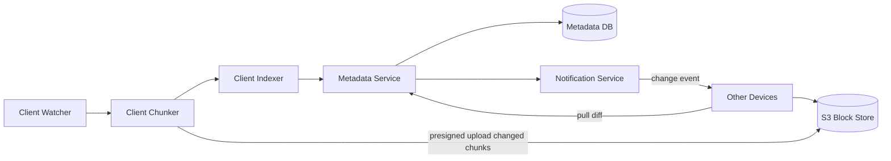

# Google Drive / Dropbox

### 1. Requirements
**Functional**
- Upload/download files and keep a local folder synced.
- Sync changes across a user's multiple devices.
- Support file versioning.
- Share files with other users.

**Non-functional**
- Efficient sync: transfer only changed data (delta sync), not whole files.
- Near-real-time multi-device convergence.
- Durable, reliable storage with dedup.
- Handle concurrent edits / conflict resolution.

### 2. Core Entities
- **File** — logical file with an ordered list of chunks and versions.
- **Chunk/Block** — ~4MB content-hashed piece of a file (the dedup/transfer unit).
- **Metadata/Manifest** — authoritative chunk-to-file/version map (source of truth).
- **Device** — a client to keep in sync.
- **User** — owner; sharing grants access.

### 3. API
```
GET  /files/{id}/metadata -> {chunks[], version}   // pull manifest diff
POST /files/{id}/metadata -> {version}             // commit new chunk/version map
PUT  /chunks/{hash} -> {}                           // presigned upload of a changed chunk
GET  /chunks/{hash} -> bytes
GET  /changes?cursor=... -> {events[]}              // long-poll/WebSocket for device sync
```

### 4. High-Level Design


**Components**
- **Client Watcher** — monitors the sync folder for create/update/delete events. *Why here:* sync must react instantly to local file changes without the server polling every client.
- **Client Chunker** — splits files into fixed/content-defined ~4MB chunks and hashes each. *Why here:* chunk hashing is what enables delta sync and dedup — only changed chunks are transferred, slashing bandwidth and sync time.
- **Client Indexer** — maintains the local chunk-to-file map and drives upload/download decisions. *Why here:* it computes the diff between local and remote state so the client uploads/downloads the minimal set of chunks.
- **Metadata Service + Metadata DB** — authoritative file/version/chunk-list records. *Why here:* the source of truth is the ordered chunk manifest, not the bytes — conflict resolution and versioning all happen here.
- **S3 Block Store** — stores the actual content chunks, addressed by hash. *Why here:* hash-addressed blob storage gives global dedup (identical chunks stored once) and lets clients upload directly via presigned URLs.
- **Notification Service** — long-poll/WebSocket push of change events to a user's other devices. *Why here:* near-real-time multi-device sync requires actively notifying idle clients rather than waiting for them to poll.
- **Other Devices** — pull the metadata diff then fetch only the new chunks. *Why here:* convergence across all of a user's devices is the whole point, achieved by syncing the manifest then the minimal chunk set.

The client watcher detects a local change; the chunker splits the file into ~4MB content-hashed chunks and uploads only the changed ones directly to the block store via presigned URLs. The indexer sends the new chunk/version manifest to the metadata service, which records it as the source of truth and triggers the notification service to push a change event to the user's other devices. Those devices pull the metadata diff, then fetch only the new chunks to converge.

### 5. Deep Dives
- **Delta sync via content-hashed chunking** — re-uploading a whole file on every edit is wasteful. Splitting into hashed chunks means only changed chunks transfer, and identical chunks dedup globally (stored once). Tradeoff: chunking/hashing CPU on the client and chunk-boundary handling, but bandwidth and sync time drop dramatically.
- **Metadata manifest as source of truth** — the bytes aren't authoritative; the ordered chunk manifest is. Versioning, conflict detection, and sharing all operate on metadata, so it must be strongly consistent. Tradeoff: a heavier metadata service, but it cleanly separates the small mutable manifest from large immutable blobs.
- **Change notification for multi-device sync** — idle devices shouldn't poll constantly. Long-poll/WebSocket push of change events triggers devices to pull the manifest diff promptly. Tradeoff: maintaining live connections/cursors per device, but it gives near-real-time convergence cheaply.
- **Conflict resolution for concurrent edits** — two devices editing offline produce divergent versions. Versioned manifests detect the conflict; the system keeps both (conflicted-copy) or merges per policy rather than silently overwriting. Tradeoff: occasional user-visible conflict copies, accepted over data loss.
