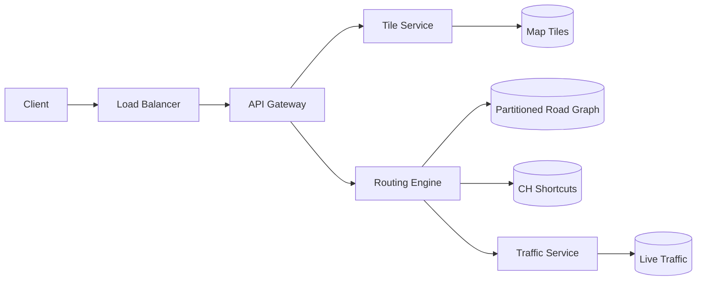

# Google Maps

### 1. Requirements
**Functional**
- Render the map: serve map tiles for the visible viewport at the requested zoom.
- Compute fastest/shortest route between two points (directions).
- Incorporate live traffic into route weights and ETAs.

**Non-functional**
- Sub-second routing latency on a planet-scale road graph.
- Highly available, read-heavy tile serving (CDN-cacheable).
- Handle continent-scale graphs too large for one machine.
- Freshness: traffic updates reflected within minutes.

### 2. Core Entities
- **Road Graph** — nodes (intersections) and weighted edges (road segments).
- **Tile** — a pre-rendered/vector map image addressed by quadtree (zoom/x/y).
- **Route** — an ordered path of edges from origin to destination with an ETA.
- **Traffic Edge Speed** — current speed/weight for a road segment.

### 3. API
```
GET /tiles/{z}/{x}/{y}                       -> tile (image/vector)
GET /route?origin={lat,lng}&dest={lat,lng}&mode=driving  -> { path, distance, etaSeconds }
GET /traffic?bbox=                            -> [edgeId -> currentSpeed]
```

### 4. High-Level Design



**Components**
- **Tile Service + Map Tiles** — serves pre-rendered/vector tiles addressed by a quadtree (zoom/x/y). *Why here:* rendering the whole planet on demand is impossible; quadtree tiling lets the client fetch only the visible viewport at the right zoom, cached at the CDN.
- **Routing Engine** — answers shortest/fastest-path queries. *Why here:* a raw Dijkstra over a continent-scale graph is seconds-slow; this engine applies the hierarchy to hit millisecond latency.
- **Partitioned Road Graph** — the road network as nodes/edges, sharded by geographic region. *Why here:* the graph is too large for one machine; regional partitioning enables parallel preprocessing, and cross-region routes are stitched at boundary nodes.
- **CH Shortcuts (Contraction Hierarchies)** — precomputed shortcut edges between important nodes. *Why here:* this is the precomputation that turns long-distance queries into a small bidirectional search ("jump" highway-to-highway instead of crawling every local street).
- **Traffic Service + Live Traffic** — current edge speeds from probe/GPS data. *Why here:* "fastest route" depends on real-time congestion; edge weights must be reweighted dynamically, which plain static CH can't capture without time-dependent extensions.
- **API Gateway** — routes tile vs. routing vs. traffic requests. *Why here:* cleanly separates the read-heavy tile/CDN path from the compute-heavy routing path.

The client fetches quadtree-addressed tiles from the tile service (CDN-cached) to render the viewport, and sends an A-to-B query to the routing engine. The routing engine expands only a tiny region by jumping along precomputed contraction-hierarchy shortcuts over the geographically partitioned road graph, then reweights edges using live traffic from the traffic service before returning the path and ETA.

### 5. Deep Dives
- **Graph partitioning** — The road graph is too large for one machine, so it is sharded by geographic region. This enables parallel preprocessing; cross-region routes are stitched together at boundary nodes. Tradeoff: boundary stitching adds complexity to long-distance queries.
- **Precomputed routing (contraction hierarchies)** — Raw Dijkstra over a continent is seconds-slow. CH precomputes shortcut edges between important nodes so a long-distance query becomes a small bidirectional search that "jumps" highway-to-highway instead of crawling every local street, hitting millisecond latency. Tradeoff: heavy offline preprocessing and shortcuts that must be rebuilt when the map changes.
- **Folding in live traffic** — "Fastest route" depends on real-time congestion, but static CH bakes in fixed weights. Live edge speeds from GPS/probe data must dynamically reweight edges; this needs time-dependent/customizable CH extensions so precomputation isn't fully invalidated. Tradeoff: dynamic reweighting limits how much can be precomputed.
- **Tile serving** — Rendering the planet on demand is impossible; quadtree tiling lets the client fetch only the visible viewport at the right zoom, served from the CDN. This cleanly separates the read-heavy tile path from the compute-heavy routing path.

