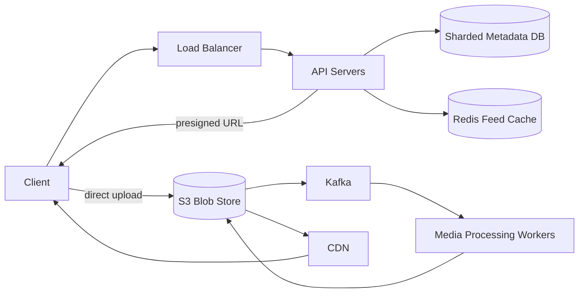

# Instagram

### 1. Requirements
**Functional**
- Upload a photo/video with caption.
- View a home feed of posts from followed accounts.
- Follow accounts and like posts.

**Non-functional**
- Low-latency media delivery globally (CDN-served).
- Read-heavy feed; high availability, eventual consistency OK.
- App servers must not become a media-bandwidth bottleneck.
- Scale: billions of posts, hundreds of millions of daily feed reads, large media objects.

### 2. Core Entities
- **Post** — author, caption, references to media objects, timestamp.
- **Media** — original + processed variants stored as immutable blobs.
- **User** — profile and follow graph.
- **Feed** — per-user precomputed list of post IDs.

### 3. API
```
POST /media/upload-url     -> { presignedUrl, mediaId }
POST /posts                -> { mediaId, caption } => { postId }
GET  /feed?cursor=...      -> { posts[], nextCursor }
POST /posts/{id}/like      -> like a post
```

### 4. High-Level Design


**Components**
- **API Servers** — handle metadata, presigned-URL issuance, and feed reads. *Why here:* they never touch the binary payload, so they stay lightweight and don't become a bandwidth bottleneck.
- **Presigned URL + direct S3 upload** — client uploads bytes directly to object storage. *Why here:* photos/videos are large; routing them through app servers would saturate them, so the upload bypasses the API entirely.
- **S3 Blob Store** — stores original and processed media as immutable objects. *Why here:* media is large, immutable, and cheap-to-store — exactly object-storage's sweet spot, kept apart from queryable metadata.
- **Kafka + Media Processing Workers** — transcode into thumbnails/resolutions, strip EXIF. *Why here:* generating multiple variants is slow and bursty, so it runs async off the upload-complete event rather than blocking the user.
- **Sharded Metadata DB** — post records, captions, likes, follow graph. *Why here:* the feed references posts (not blobs), and this structured, queryable state must shard to handle billions of posts.
- **Redis Feed Cache** — precomputed per-user feeds (post-ID references). *Why here:* like the Twitter feed, reads dominate, so feeds are precomputed; the cache holds references, not the media itself.
- **CDN** — edge-caches and serves images/video to users. *Why here:* media delivery is the dominant traffic; serving from edge POPs cuts latency and offloads origin bandwidth.

The client requests a presigned URL from the API and uploads media bytes directly to S3, bypassing the app servers. The upload-complete event flows through Kafka to processing workers that transcode size variants and strip EXIF back into S3. The post record lands in the sharded metadata DB and is fanned out into follower feed caches, while reads serve images through the CDN.

### 5. Deep Dives
- **Media plane vs metadata plane** — Routing large media through app servers would saturate their bandwidth. Presigned direct-to-S3 upload keeps app servers lightweight (metadata only); media is immutable blob storage, served via CDN edge POPs. This separation is the central design decision.
- **Async processing** — Generating thumbnails/resolutions and stripping EXIF is slow and bursty, so it runs off the upload-complete event via Kafka workers rather than blocking the user; the post can show a placeholder until variants are ready.
- **Feed fan-out** — Same hybrid push/pull problem as Twitter: precompute feeds in Redis (storing post-ID references, not media), pull for high-follower accounts, merge on read.
- **Metadata sharding** — Billions of structured, queryable post/like/follow records must shard (e.g. by user ID); the feed references post IDs that resolve to metadata, never to blobs directly.

