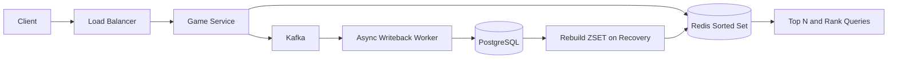

# Leaderboard (gaming/ranking)

### 1. Requirements
**Functional**
- Submit/update a player's score.
- Return the top-N players.
- Return a given player's rank and a window of players around them.

**Non-functional**
- Real-time, sub-10ms rank and top-N reads against millions of players.
- High write rate for score updates; durable system of record (scores must survive Redis failover).
- Availability over strict consistency for non-top ranks; eventual consistency tolerable on rebuild.
- Scale: 10M+ players per board, thousands of score updates/sec during peak.

### 2. Core Entities
- **Player** — a competitor identified by user ID.
- **Score** — a player's current value on a board (member + score in the sorted set).
- **Leaderboard** — a named ranking (global, per-game, per-time-window).
- **Rank** — a player's position, derived from the sorted set.

### 3. API
```
POST /leaderboards/{id}/scores { user_id, score } -> 200      (ZADD)
GET  /leaderboards/{id}/top?n=100 -> [ {user_id, score, rank} ]
GET  /leaderboards/{id}/rank/{user_id} -> { rank, score }
GET  /leaderboards/{id}/around/{user_id}?range=5 -> [ ... ]
```

### 4. High-Level Design


**Components**
- **Game Service** — validates score submissions and issues ZADD plus rank/range reads. *Why here:* it shields Redis from invalid/abusive writes and is the single place rank queries (ZRANK, ZREVRANGE) are composed.
- **Redis Sorted Set** — keeps members ordered by score with O(log N) insert and O(log N + k) range reads. *Why here:* "what is my rank" and "top 100" against millions of players in real time is exactly the ZSET's specialty; no SQL ORDER BY/LIMIT or index gives this at that latency and write rate.
- **Kafka + Async Writeback Worker** — buffers score events and flushes them to the durable store off the hot path. *Why here:* Redis is the fast read layer, not the source of truth; decoupling persistence keeps submission latency low while still capturing every score.
- **PostgreSQL** — durable system of record for scores, supporting historical/complex queries. *Why here:* Redis can lose data on failover and isn't meant for ad-hoc analytics; the DB makes scores recoverable and queryable beyond ranking.
- **Rebuild ZSET on Recovery** — replays scores from Postgres (or Kafka) to repopulate Redis after a crash. *Why here:* because the leaderboard lives in memory, you need an explicit warm-from-durable-store path; top shards are warmed first and non-top ranks tolerate brief eventual consistency.

A score update goes to the Game Service, which validates it and issues a ZADD into the Redis Sorted Set, giving O(log N) inserts and O(log N + k) range reads for rank/top-N queries. The same event is published to Kafka, where an Async Writeback Worker persists the durable score to Postgres off the hot path. If Redis is lost, the sorted set is rebuilt by replaying scores from Postgres (or Kafka).

### 5. Deep Dives
- **Redis sorted sets** — "what is my rank" and "top 100" over millions of players in real time is the ZSET's specialty (ZADD, ZRANK, ZREVRANGE). A SQL ORDER BY/LIMIT can't meet this latency and write rate. Tradeoff: in-memory only, so durability must come from elsewhere.
- **Durability + rebuild path** — Redis can lose data on failover, so Postgres is the source of truth, written asynchronously via Kafka. On recovery the ZSET is warmed from durable storage, top shards first. Tradeoff: brief eventual consistency for non-top ranks during rebuild.
- **Sharding** — once one ZSET can't fit or absorb the write rate, shard by score range or user hash and scatter-gather the top-N/rank queries. Tradeoff: cross-shard rank queries require merging partial results, adding read complexity.
- **Write decoupling** — buffering score events in Kafka keeps submission latency low and absorbs spikes. Tradeoff: the durable store lags the live ZSET slightly, acceptable since Redis serves the authoritative read path.

