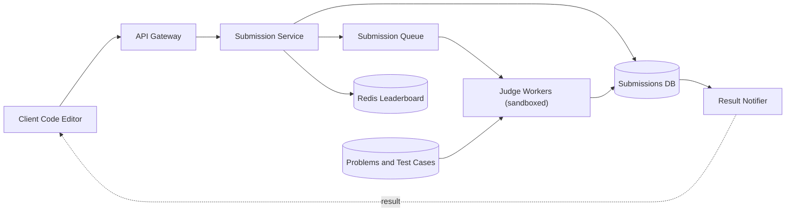

# LeetCode / Online Judge

### 1. Requirements
**Functional**
- Submit code for a problem and run it against hidden test cases.
- Return a verdict (Accepted, Wrong Answer, TLE, etc.) asynchronously.
- Support submission history and live contest leaderboards.

**Non-functional**
- Secure execution of untrusted, possibly-malicious code (strong isolation).
- Graceful handling of bursty load (everyone submits at contest start) via autoscaling + backpressure.
- Responsive UX: instant job acknowledgment, push the verdict when ready.
- Scale: thousands of concurrent submissions during contests, sub-second judging per simple submission.

### 2. Core Entities
- **User** — a competitor / learner.
- **Problem** — statement plus hidden test cases and limits.
- **Submission** — one attempt with code, language, status, verdict.
- **Test Case** — input + expected output for a problem.
- **Judge Job** — a queued unit of work for a worker.

### 3. API
```
POST /submissions   { problem_id, language, code } -> { job_id, status: "queued" }
GET  /submissions/{id} -> { status, verdict, runtime, memory }
WS   /submissions/{id}/subscribe -> pushes verdict
GET  /contests/{id}/leaderboard -> [ {user, score, rank} ]
```

### 4. High-Level Design


**Components**
- **Client Code Editor** — submits run/submit requests and listens for the verdict. *Why here:* execution is slow and variable, so the client gets a `job_id` instantly and subscribes for the result rather than blocking on the HTTP call.
- **API Gateway** — auth, routing, and per-user submit rate limiting. *Why here:* every submission triggers expensive, untrusted code execution, so abuse must be throttled at the edge before it reaches compute.
- **Submission Service** — validates input, persists the submission, enqueues the job, returns `job_id` immediately. *Why here:* it decouples the fast request/response from the slow judging so "Run" feels instantaneous and the system stays responsive under load.
- **Submissions DB** — durable record of every attempt, status, and verdict. *Why here:* powers submission history, analytics, and contest scoring; relational fits the user↔problem↔submission joins.
- **Submission Queue (Kafka/BullMQ)** — buffers jobs, supports priority, smooths spikes. *Why here:* load is extremely bursty (everyone submits at contest start) and judging is slow — the queue absorbs spikes and applies backpressure instead of melting the workers.
- **Judge Workers (sandboxed)** — pull a job, compile + run the code against test cases inside an isolated sandbox with strict limits. *Why here:* this IS the core problem — safely running untrusted, possibly-malicious code. Isolation uses Linux namespaces (process isolation), cgroups (CPU/memory caps), seccomp (syscall filtering), no network, read-only FS, and a wall-clock timeout; large scale uses pre-warmed Docker/gVisor or Firecracker microVMs (snapshot restore ~25ms) for hardware-level isolation with low cold-start.
- **Problems and Test Cases store** — problem statements + hidden test inputs/expected outputs (often object storage + metadata DB). *Why here:* workers need the canonical test data; it's read-heavy and cached/distributed to every worker.
- **Result Notifier** — pushes the verdict to the client via WebSocket/SSE keyed by `job_id`. *Why here:* because judging is async, the client needs a push channel instead of polling for a result that may take seconds.
- **Redis Leaderboard** — sorted-set contest rankings. *Why here:* live standings need O(log n) rank updates at high write rates during contests — exactly what Redis sorted sets give.

A submission passes through the API Gateway (auth + rate limiting) to the Submission Service, which validates and persists it, enqueues a job, and immediately returns a `job_id`. A sandboxed Judge Worker pulls the job, fetches the hidden test cases, compiles and runs the code under strict isolation and limits, and writes the verdict. The Result Notifier then pushes the result back to the client over WebSocket/SSE, while contest standings update in the Redis sorted-set leaderboard.

### 5. Deep Dives
- **Secure sandboxing** — this IS the core problem: safely running untrusted code. Isolation combines Linux namespaces (process isolation), cgroups (CPU/memory caps), seccomp (syscall filtering), no network, read-only FS, and wall-clock timeouts; at scale, pre-warmed gVisor or Firecracker microVMs (snapshot restore ~25ms) give hardware-level isolation with low cold-start. Tradeoff: stronger isolation (microVMs) vs. lower overhead (containers).
- **Async submit + result push** — judging is slow and variable, so the client gets a `job_id` instantly and subscribes for the verdict via WebSocket/SSE instead of blocking or polling. Tradeoff: extra push infrastructure, but the UI feels instantaneous and the system stays responsive.
- **Autoscaling worker pool + queue** — contest spikes are extreme and bursty. A durable queue (Kafka/BullMQ) buffers jobs, supports priority, and applies backpressure while the worker fleet autoscales. Tradeoff: queued submissions may wait longer under peak, but the system degrades gracefully instead of melting hosts.
- **Test-case distribution** — workers need canonical hidden test data; it's read-heavy and stored in object storage + metadata DB, cached/distributed to every worker. Tradeoff: caching adds invalidation concerns when test cases change, but avoids hammering the store on every judge run.
