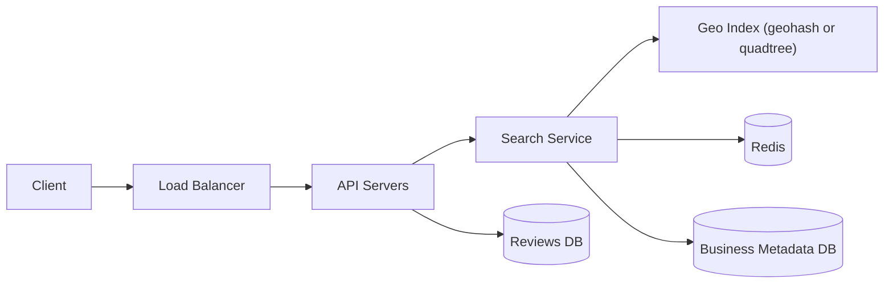

# Nearby Places

### 1. Requirements
**Functional**
- Find businesses within a radius of a user's location.
- Filter by attributes (category, open-now, min rating) and rank results.
- Return business details and aggregate ratings/reviews.

**Non-functional**
- Low-latency radius queries that stay fast across wildly varying density (dense cities vs. rural).
- Read-heavy; highly available.
- Accurate distance ranking (true distance, not just cell membership).
- Scale to hundreds of millions of businesses; cache hot/dense areas.

### 2. Core Entities
- **Business** — name, category, hours, address, lat/long (source of truth).
- **Geo Cell** — a geohash/quadtree bucket grouping nearby businesses.
- **Review** — a rating + text for a business.
- **Search Query** — location + radius + filters + ranking.

### 3. API
```
GET /search/nearby?lat=&lng=&radius=&category=&openNow=&minRating=  -> [Business]
GET /businesses/{id}                         -> { name, category, hours, location, rating }
GET /businesses/{id}/reviews?cursor=         -> [Review]
POST /businesses/{id}/reviews                -> { reviewId }
```

### 4. High-Level Design



**Components**
- **Search Service** — geo + keyword/filter query planner. *Why here:* "coffee shops within 2km, open now, 4+ stars" combines spatial pruning with attribute filtering and ranking in one path.
- **Geo Index (geohash / quadtree)** — spatial index bucketing businesses into cells. *Why here:* answering "within radius" without an index means scanning every business on earth; geohash/quadtree reduce it to a handful of cells. Quadtree adapts to density (dense cities vs. sparse rural), geohash gives cheap prefix lookups — both far better than a 2D B-tree for this query.
- **Business Metadata DB** — name, category, hours, address, lat/long (source of truth). *Why here:* the index returns IDs; full record details must come from durable storage. Data is mostly static, so the index can be precomputed.
- **Reviews DB** — ratings and review text, separated from metadata. *Why here:* reviews are write-heavy and high-volume with different access patterns than business attributes, so splitting them avoids bloating the hot lookup.
- **Redis Cache** — caches popular cell queries and dense-area results. *Why here:* a few cells (downtown areas) get queried constantly; caching them cuts index load and tail latency.
- **API Servers** — fan out to search and reviews, assemble the response. *Why here:* keeps the geo path and the review-join path independently scalable.

The search service maps the user's location to a geohash/quadtree cell, gathers candidate business IDs from that cell plus its neighbors (checking Redis first for hot/dense cells), then re-ranks candidates by exact distance, rating, and filters. It hydrates full records from the business metadata DB, while review reads/writes go to a separate reviews store on their own path.

### 5. Deep Dives
- **Spatial indexing (geohash vs. quadtree)** — Answering "within radius" without an index means scanning every business on earth. Geohash gives cheap prefix lookups and fixed-grid simplicity; quadtree adapts subdivision to density so dense city cells don't blow up while rural cells stay coarse. Both beat a 2D B-tree for this query. Tradeoff: geohash needs explicit neighbor-cell handling at boundaries and fixed precision struggles with uneven density.
- **Candidate gathering + neighbor cells** — A point near a cell edge has nearby results in adjacent cells, so the search must query the target cell plus its neighbors, then re-rank by true haversine distance to avoid missing or mis-ordering edge results. Tradeoff: tuning cell precision balances candidate-set size against recall.
- **Data store separation** — Business metadata is mostly static (precomputable index), while reviews are write-heavy with different access patterns. Splitting metadata and reviews keeps the hot geo-lookup path lean. Tradeoff: assembling a full result requires joining across stores.
- **Caching dense areas** — A handful of downtown cells get queried constantly; caching popular cell-query results in Redis cuts index load and tail latency, at the cost of slight staleness for those areas.
