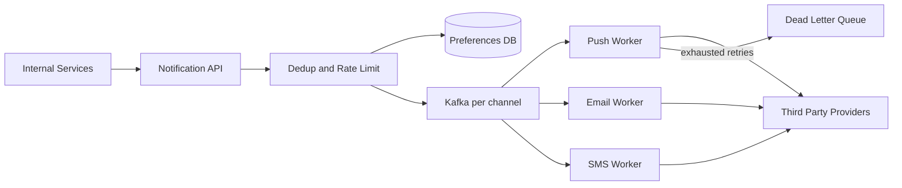

# Notification System

### 1. Requirements
**Functional**
- Let internal services trigger notifications to users.
- Support multiple channels: push, email, SMS.
- Respect user preferences (opt-ins, quiet hours).
- Deduplicate and rate-limit so users aren't spammed.

**Non-functional**
- Reliable delivery with retries; no double-sends.
- High throughput and channel isolation (one provider outage shouldn't block others).
- Eventual delivery is acceptable; some channels are best-effort.
- Scale: millions of notifications/day across heterogeneous providers.

### 2. Core Entities
- **Notification** — an event to deliver: recipient, channel, template, payload.
- **User Preferences** — per-channel opt-ins, quiet hours, language.
- **Template** — channel-specific rendering of content.
- **DeliveryAttempt** — record of a send with status/retries.

### 3. API
```
POST /notifications -> {notificationId}
   body: {userId, type, channels[], data, idempotencyKey}
GET  /notifications/{id} -> {status}
PUT  /users/{id}/preferences -> {}   // channel opt-ins, quiet hours
```

### 4. High-Level Design


**Components**
- **Notification API** — single ingress for all triggering services. *Why here:* it gives every internal producer one consistent contract and a place to enforce auth, validation, and idempotency keys.
- **Dedup + Rate Limit** — collapses duplicate events and caps notifications per user/channel/window. *Why here:* without it, a single noisy event (an edited comment, a retry storm) spams users and gets the app's sender reputation throttled.
- **Preferences DB** — per-user channel opt-ins, quiet hours, and language. *Why here:* a fast pre-send lookup is mandatory to respect consent and quiet hours on every notification.
- **Kafka per channel** — separate queues for push/email/SMS. *Why here:* channels have wildly different throughput and failure modes, so isolating them prevents one provider's outage from blocking the others.
- **Channel Workers (Push/Email/SMS)** — render templates and call the right provider per channel. *Why here:* each channel has its own payload format, token type, and provider API, so delivery logic must be channel-specific.
- **Third-Party Providers** — APNs/FCM, SES/SendGrid, Twilio, etc. *Why here:* actual delivery to devices and carriers is outsourced; the system orchestrates rather than owns last-mile delivery.
- **Dead Letter Queue** — captures messages that fail after retry-with-backoff. *Why here:* a single poison message must not block a worker, and failures need to be parked for inspection and replay.

Internal services post events to the notification API, which deduplicates on idempotency keys, applies per-user rate limits, and filters against the preferences DB (quiet hours, opt-outs). Surviving notifications are enqueued into per-channel Kafka topics, where channel-specific workers render templates and call the matching third-party provider. Failures are retried with backoff, and messages exhausting retries are parked in a dead-letter queue for inspection and replay.

### 5. Deep Dives
- **Dedup + per-user rate limiting** — a noisy event (an edited comment, a retry storm) can spam users and wreck sender reputation. Idempotency keys collapse duplicates and a per-user/channel/window counter caps volume. Tradeoff: legitimately distinct notifications may be merged or delayed, accepted to protect the user and deliverability.
- **Per-channel queues for isolation** — push, email, and SMS have wildly different throughput and failure modes. Separate Kafka topics ensure one provider's outage or backlog can't block the others. Tradeoff: more topics/consumers to operate, but failures stay contained.
- **Retry-with-backoff to DLQ** — providers fail transiently; blind retries cause storms. Exponential backoff with capped retries, then route to a DLQ, isolates poison messages without blocking the worker. Tradeoff: DLQ requires manual/automated replay tooling and monitoring.
- **Preference and quiet-hour enforcement** — consent must be respected on every send, requiring a fast pre-send lookup. A cached preferences DB keyed by user gives low-latency checks before enqueueing. Tradeoff: cache staleness could briefly honor an old preference, mitigated with short TTL/invalidation.

