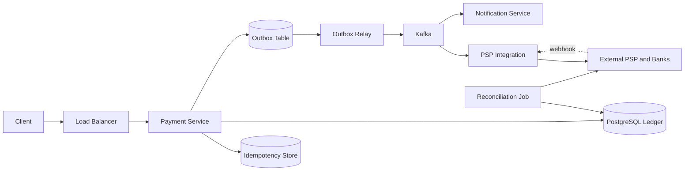

# Payment System / Digital Wallet

### 1. Requirements
**Functional**
- Charge a customer / transfer funds between wallets.
- Maintain accurate per-account balances derived from a transaction history.
- Integrate with external PSPs / banks and handle their async settlement (webhooks).
- Allow refunds and reconciliation against the provider's records.

**Non-functional**
- Correctness above all: exactly-once money movement, no double-charge, no lost/phantom payments.
- Strong consistency and durability on the ledger (ACID); auditability of every cent.
- High availability for the charge API; latency in the low hundreds of ms (external rails are async).
- Scale: ~1-10K payments/sec peak, millions of transactions/day; ledger grows append-only forever.

### 2. Core Entities
- **Account / Wallet** — an entity that holds a balance, derived from its ledger entries.
- **Transaction** — a single money-movement event (charge, transfer, refund).
- **Ledger Entry** — an immutable debit or credit row; entries of a transaction sum to zero.
- **Idempotency Key** — client-supplied key tying a request to its single result.
- **Payment / PSP Record** — external charge state (pending, settled, failed) from the provider.

### 3. API
```
POST /payments          { idempotency_key, from, to, amount, currency } -> { payment_id, status }
GET  /payments/{id}     -> { status, amount, ledger_entries }
POST /payments/{id}/refund { idempotency_key, amount } -> { refund_id, status }
GET  /accounts/{id}/balance -> { balance, currency }
POST /webhooks/psp      (provider callback) -> 200
```

### 4. High-Level Design


**Components**
- **Payment Service** — accepts charge/transfer requests, enforces idempotency, orchestrates the ledger write and downstream calls. *Why here:* money movement must be exactly-once; a retried request can never double-charge, so dedup and orchestration are the entry-point's core job.
- **Idempotency Store** — keys on a client-supplied idempotency key, storing the in-flight/final result so retries return the prior outcome. *Why here:* networks drop responses constantly; without this a timeout-and-retry would create a second payment.
- **PostgreSQL Ledger** — append-only double-entry rows where every transaction's debits equal its credits and balances are derived, not mutated. *Why here:* financial correctness and auditability demand that balances be provable from immutable entries that always sum to zero, which a single-row "balance" field cannot guarantee.
- **Outbox Table + Outbox Relay** — the event to call the PSP is written in the same DB transaction as the ledger, then a relay polls and publishes it. *Why here:* you cannot atomically write the ledger AND call an external PSP; the outbox makes "ledger committed" and "PSP will be called" inseparable, eliminating lost or phantom payments.
- **Kafka** — durable async buffer between the ledger commit and the slow, flaky external rails. *Why here:* PSP/bank calls take seconds and fail; decoupling keeps the synchronous path fast and retryable.
- **PSP Integration / External PSP and Banks** — talks to Stripe/Adyen/card networks and receives async status via registered webhooks. *Why here:* you almost never touch card rails directly; the PSP holds PCI scope and reports final settlement asynchronously, so the design must be webhook-driven, not request/response.
- **Reconciliation Job** — parses the PSP's daily settlement file and diffs it against the ledger, flagging mismatches. *Why here:* the external system is the ultimate source of truth for what actually settled; reconciliation catches dropped webhooks, partial captures, and fees the internal ledger would otherwise miss.

A client request hits the Payment Service, which first checks the Idempotency Store so a retried request returns the prior result instead of charging again. In one Postgres transaction it writes balanced debit/credit ledger rows plus an event into the Outbox table; the Outbox Relay then publishes that event to Kafka, where the PSP Integration calls external rails and later receives settlement via webhook. A Reconciliation Job periodically diffs the provider's settlement file against the ledger to catch any divergence.

### 5. Deep Dives
- **Idempotency** — networks drop responses, so a timeout-and-retry must not create a second payment. The service keys on a client-supplied idempotency key, storing in-flight and final state; retries short-circuit to the stored outcome. Tradeoff: extra write/lookup per request and key-TTL management, in exchange for exactly-once guarantees.
- **Double-entry ledger** — a single mutable "balance" field can't be audited or proven correct. Instead, balances are derived from immutable debit/credit entries that always sum to zero per transaction. Tradeoff: balance reads require aggregation (mitigated with periodic snapshots/materialized balances) but financial correctness and auditability are guaranteed.
- **Transactional outbox** — you can't atomically commit the ledger AND call an external PSP. Writing the PSP-call event in the same DB transaction as the ledger, then relaying it, makes "ledger committed" and "PSP will be called" inseparable. Tradeoff: at-least-once delivery to the PSP (so the PSP call itself must be idempotent) and added relay latency.
- **Reconciliation** — the external rail is the ultimate source of truth for what settled. A daily job parses the PSP settlement file and flags mismatches (dropped webhooks, partial captures, fees). Tradeoff: eventual rather than immediate correctness, but it's the essential backstop when ledger and provider disagree.

