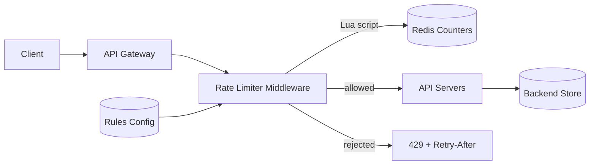

# Rate Limiter

### 1. Requirements
**Functional**
- Allow or reject each request based on a per-client limit.
- Support different limits per route and per customer tier.
- Return a clear rejection (429 + Retry-After) when over limit.

**Non-functional**
- Limits enforced globally across all gateway nodes (consistent).
- Very low added latency per request (sub-ms ideal).
- Accurate under concurrency — no client should exceed its limit via races.
- Scale: tens of thousands of requests/sec across a fleet of gateways.

### 2. Core Entities
- **Client / Identity** — API key, user ID, or IP the limit applies to.
- **Bucket / Counter** — per-client state (token count + last-refill timestamp).
- **Rule** — limit definition (rate, burst) per route/tier.

### 3. API
```
(internal middleware, not a public endpoint)
allow(clientId, route) -> { allowed: bool, retryAfter?: seconds }
GET  /rules            -> current limit config
PUT  /rules/{route}    -> update limit (hot-reloaded)
```

### 4. High-Level Design


**Components**
- **API Gateway** — single ingress where the limiter sits. *Why here:* enforcing limits at the edge rejects abusive traffic before it consumes downstream compute and DB capacity.
- **Rate Limiter Middleware** — implements the algorithm (token bucket / sliding window). *Why here:* token bucket allows controlled bursts while capping the long-run rate, which is the standard requirement for API quotas.
- **Redis Counters** — shared store for each client's bucket state (token count + last-refill timestamp). *Why here:* limits must be enforced globally across all gateway nodes, so per-node memory won't work; Redis gives a low-latency shared counter.
- **Lua script (atomic check-and-decrement)** — bundles read, refill, and decrement into one atomic op. *Why here:* without atomicity, concurrent requests race and let clients exceed the limit; Lua eliminates the read-modify-write race.
- **Rules Config** — per-route/per-tier limit definitions, hot-reloaded. *Why here:* different endpoints and customer tiers need different ceilings, so rules must be data-driven, not hard-coded.
- **429 + Retry-After** — rejection response. *Why here:* signaling the limit (and when to retry) lets well-behaved clients back off instead of hammering.

Every request enters the API gateway and passes through the rate-limiter middleware, which loads the applicable rule and runs an atomic Lua script in Redis to refill and decrement the client's token bucket. If a token is available the request is forwarded to the API servers; otherwise it returns 429 with a Retry-After header.

### 5. Deep Dives
- **Atomic check-and-decrement** — Concurrent requests doing read-modify-write on a counter race and let clients overshoot. A single Redis Lua script bundles read + refill + decrement into one atomic op, eliminating the race while keeping latency low.
- **Algorithm choice** — Token bucket allows controlled bursts while capping the long-run rate, fitting typical API quotas; sliding-window-counter is an alternative that smooths the boundary spikes that fixed windows allow. Tradeoff is memory/precision vs simplicity.
- **Global vs local enforcement** — Per-node memory can't enforce a global limit across a gateway fleet, so state lives in shared Redis. To shave latency, nodes can use a local token cache synced to Redis, trading a small amount of over-admission for fewer round trips.
- **Failure mode** — If Redis is unreachable you must choose fail-open (allow, prioritizing availability) vs fail-closed (reject, prioritizing protection); most APIs fail open with alerting.

