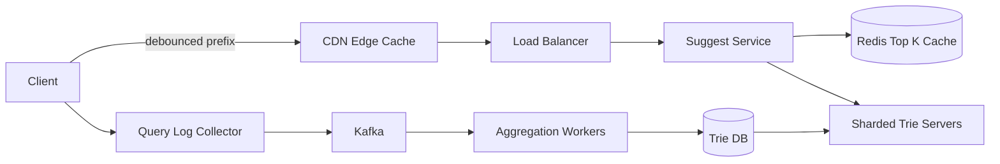

# Search Autocomplete (Typeahead)

### 1. Requirements
**Functional**
- Return top-k completions for a typed prefix.
- Rank suggestions by real-world popularity.
- Update suggestions over time as query trends change.

**Non-functional**
- Sub-100ms per-keystroke latency.
- Extremely read-heavy; suggestions can be slightly stale (eventual freshness is fine).
- High availability.
- Scale: serve a huge keystroke QPS; aggregate billions of historical queries to build rankings.

### 2. Core Entities
- **Query** — a logged user search string with frequency.
- **Prefix** — a string of typed characters.
- **Suggestion** — a completion with a popularity score.
- **TrieNode** — node holding precomputed top-k completions for its prefix.

### 3. API
```
GET /suggest?prefix=harr&limit=10 -> {suggestions: ["harry potter", ...]}
POST /queries -> {}   // log a submitted query (fire-and-forget, feeds build pipeline)
```

### 4. High-Level Design


**Components**
- **Client debounce** — waits ~50-100ms between keystrokes before firing a request. *Why here:* every character would otherwise trigger a query; debouncing cuts request volume drastically for a per-keystroke workload.
- **CDN / Edge Cache** — caches popular prefixes geographically close to users. *Why here:* autocomplete demands sub-100ms responses, so edge caching of hot prefixes is what meets the latency budget.
- **Suggest Service** — looks up the top-k completions for a prefix. *Why here:* it fronts the trie with a Redis cache so the vast majority of prefixes are served without touching the trie servers.
- **Redis Top-K Cache** — stores precomputed top-k results per hot prefix. *Why here:* a prefix's answer is stable for hours, so caching the answer (not just the data) collapses read latency.
- **Sharded Trie Servers** — in-memory prefix trees with precomputed top-k per node, sharded by prefix. *Why here:* a trie answers "top queries starting with X" in O(prefix length); a relational scan cannot meet typeahead latency.
- **Query Log Collector + Kafka** — captures what users actually search and submit. *Why here:* completions must reflect real popularity, which only the query stream reveals.
- **Aggregation Workers** — periodically count query frequencies and rebuild the trie (scatter-gather merge of per-shard top-k). *Why here:* the trie is read-optimized and expensive to mutate live, so it is rebuilt offline from aggregated logs rather than updated per query.
- **Trie DB** — persistent snapshot of the built trie loaded by trie servers. *Why here:* trie servers are in-memory, so a durable snapshot is needed to recover and to hot-swap new builds.

A debounced prefix request hits the suggest service through an edge cache; the service first checks a Redis top-k cache and falls back to the sharded trie servers, which store precomputed top-k per node. Separately, submitted queries flow to a log collector and Kafka, where aggregation workers periodically count frequencies and rebuild the trie, loading a fresh snapshot from the trie DB into the trie servers. The read path and the build path are deliberately decoupled.

### 5. Deep Dives
- **Precomputed top-k trie vs. live computation** — computing top completions per prefix at request time is too slow. Each trie node caches its top-k completions so a lookup is O(prefix length). Tradeoff: the trie is read-optimized and expensive to mutate, so it's rebuilt offline rather than updated per query.
- **Offline aggregation + rebuild pipeline** — suggestions must reflect real popularity, which only the query stream reveals. Workers aggregate logs over a window and build a new trie snapshot, then hot-swap it. Tradeoff: suggestions lag real-time trends by the rebuild interval, accepted because typeahead answers are stable for hours.
- **Sharding the trie + scatter-gather** — one trie won't fit in memory or absorb the QPS. Shard by prefix range; for short/ambiguous prefixes that span shards, scatter to relevant shards and merge top-k. Tradeoff: cross-shard merges add latency for short prefixes, mitigated by caching hot ones.
- **Multi-layer caching (CDN + Redis)** — autocomplete's latency budget demands answers near the user. Hot prefixes are served from the CDN edge and Redis before ever touching trie servers. Tradeoff: stale cached results until TTL expires, acceptable given slow-changing rankings.

