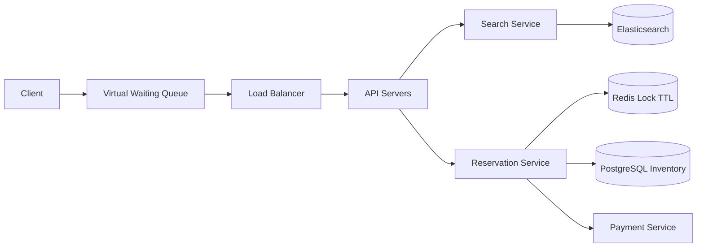

# Ticketmaster

### 1. Requirements
**Functional**
- Browse/search events and view real-time seat availability for a venue.
- Reserve (hold) one or more specific seats for a limited window during checkout.
- Purchase held seats via payment, confirming the booking.

**Non-functional**
- Strong consistency on inventory: a seat is never double-sold (correctness over availability for the booking path).
- Survive massive concurrency spikes on hot on-sales: ~10M+ users hitting one event in seconds.
- Low-latency, highly available browse/search path (reads vastly outnumber writes).
- Seat-hold TTL ~10 min; tens of thousands of bookings/sec at peak for a popular event.

### 2. Core Entities
- **Event** — a show at a venue on a date, with a seat map.
- **Seat** — a discrete inventory unit (e.g. 14A) with status available/held/booked.
- **Reservation** — a temporary hold linking a user to seats with an expiry.
- **Booking** — a confirmed purchase after payment succeeds.
- **User** — the buyer.

### 3. API
```
GET  /events/search?q=&city=&date=        -> [Event]
GET  /events/{id}/seats                    -> [Seat] (status)
POST /events/{id}/reservations             -> { reservationId, seats, expiresAt }
     body: { seatIds: [...] }
POST /reservations/{id}/purchase           -> { bookingId, status }
     body: { paymentToken }
DELETE /reservations/{id}                   -> 204 (release hold)
```

### 4. High-Level Design



**Components**
- **Virtual Waiting Queue** — admits users into the booking flow at a controlled rate (token/position based) for hot on-sales. *Why here:* a Taylor Swift drop sends millions of concurrent users at one event in seconds; queueing flattens the thundering herd so the inventory DB and lock store never see the full spike.
- **API Servers** — stateless front door routing to search vs. booking. *Why here:* lets the read-heavy browse path scale independently from the contention-heavy booking path.
- **Search Service + Elasticsearch** — full-text/faceted discovery of events and venues. *Why here:* browsing events ("concerts in NYC this weekend") is a fuzzy search workload that a transactional inventory DB serves poorly.
- **Reservation Service** — orchestrates the hold-then-purchase state machine (available → held → booked). *Why here:* a seat must be exclusively held during checkout but auto-released if the user abandons; this needs its own coordinator.
- **Redis Lock (TTL)** — distributed lock per seat with ~10 min expiry. *Why here:* prevents two buyers from taking the same seat; the TTL auto-frees abandoned carts without a cleanup cron, which a plain DB row-lock can't do gracefully.
- **PostgreSQL Inventory** — source-of-truth seat status, updated transactionally. *Why here:* money plus discrete unique inventory (seat 14A exists once) demands ACID and serializable updates; double-selling a seat is unacceptable.
- **Payment Service** — captures payment, then commits booking to confirmed. *Why here:* externalizes PSP latency/failure from the lock window and enables idempotent retries.

A client is admitted from the virtual waiting queue at a controlled rate, then hits the stateless API servers. Browse/search queries route to the search service backed by Elasticsearch. When the user picks seats, the reservation service grabs a TTL distributed lock per seat in Redis and writes an in-progress booking row to PostgreSQL; payment then finalizes the sale and commits the inventory transactionally.

### 5. Deep Dives
- **Seat reservation locking** — Two buyers must never take the same seat. Holding a DB transaction open for the entire checkout would exhaust connections under load. Instead use a held state plus a per-seat Redis distributed lock with a ~10 min TTL: the lock auto-releases abandoned carts without a cleanup cron, and the final commit to PostgreSQL (serializable update) is the source of truth. Tradeoff: Redis lock adds an external dependency and a small consistency gap closed by the authoritative DB write.
- **Virtual waiting queue** — A drop sends millions of concurrent users in seconds. A token/position-based waiting queue admits users into the booking flow at a controlled rate, flattening the thundering herd so the lock store and inventory DB never see the full spike. Tradeoff: adds user-perceived wait time but is what keeps the system from collapsing.
- **Read/write path separation** — Browse ("concerts in NYC this weekend") is fuzzy faceted search served poorly by a transactional DB; seat booking needs ACID. Splitting search (Elasticsearch) from inventory (PostgreSQL) lets the read-heavy path scale independently from the contention-heavy booking path.
- **Payment isolation** — Externalize PSP latency/failure from the lock window: capture payment, then commit the booking to confirmed with idempotent retries so a slow processor doesn't hold inventory locks open.

