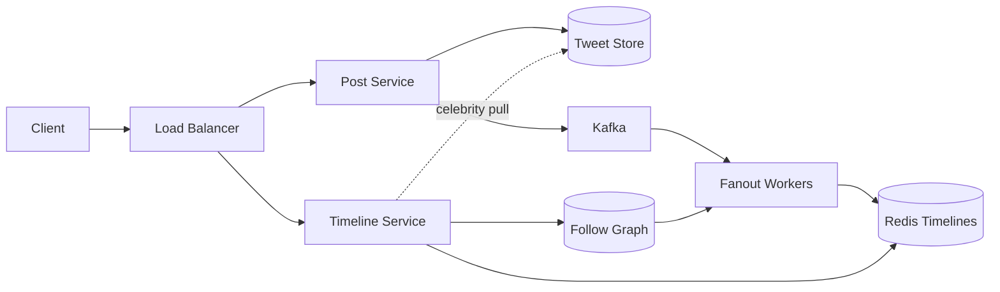

# Twitter / News Feed

### 1. Requirements
**Functional**
- Post a tweet.
- View a home timeline of tweets from followed accounts (reverse-chron or ranked).
- Follow / unfollow accounts.

**Non-functional**
- Read-heavy; feed reads must be fast (sub-200ms).
- High availability; eventual consistency on the feed is acceptable.
- Handle highly skewed fan-out (celebrities with 100M+ followers).
- Scale: ~500M tweets/day, hundreds of millions of timeline reads.

### 2. Core Entities
- **Tweet** — author, text/media refs, timestamp.
- **User** — profile and follower/following counts.
- **Follow** — directed edge (follower → followee).
- **Timeline** — per-user ordered list of tweet IDs.

### 3. API
```
POST /tweets               -> { text, mediaIds? } => { tweetId }
GET  /feed?cursor=...      -> { tweets[], nextCursor }
POST /follows/{userId}     -> follow user
DELETE /follows/{userId}   -> unfollow user
```

### 4. High-Level Design


**Components**
- **Post Service** — accepts and persists new tweets. *Why here:* writes are durable and source-of-truth, kept separate from the read-heavy timeline path.
- **Tweet Store (Cassandra)** — stores tweet bodies/metadata. *Why here:* append-heavy, partition-by-user-or-id workload at huge volume suits a wide-column store.
- **Kafka** — buffers tweets for asynchronous fan-out. *Why here:* decouples the fast write ack from the expensive job of writing to potentially millions of follower timelines.
- **Fanout Workers** — push tweet IDs into followers' timeline caches. *Why here:* precomputing timelines on write is what makes feed reads O(1) for the common case (fanout-on-write).
- **Follow Graph** — who-follows-whom. *Why here:* fan-out needs the follower list on write, and reads need the followee list to pull celebrity tweets; it gates both strategies.
- **Redis Timelines** — per-user list of recent tweet IDs. *Why here:* serving a feed from an in-memory list is the difference between sub-100ms and a fan-in query across thousands of authors.
- **Timeline Service** — assembles the final feed. *Why here:* it implements the hybrid merge — cached push timeline plus on-the-fly celebrity pull — and applies ranking.

A new tweet is persisted by the Post service and queued to Kafka. Fanout workers read the follow graph and push the tweet ID into each non-celebrity follower's precomputed Redis timeline. On read, the Timeline service returns the cached push timeline and merges it with tweets pulled on the fly from any celebrities the user follows, then ranks the result.

### 5. Deep Dives
- **Fan-out / celebrity problem** — Pure fanout-on-write collapses when an account with 100M followers posts (one write becomes 100M). The canonical fix is hybrid: push (fanout-on-write) for normal accounts, pull (fanout-on-read) for celebrities, merged at read time. Tradeoff: read path is more complex but write amplification is bounded.
- **Timeline storage** — Per-user Redis lists of recent tweet IDs make feed reads O(1) for the common case. Cap list length (e.g. last 800 IDs) and hydrate tweet bodies from the Tweet store in batch.
- **Tweet store** — Append-heavy, partition-by-id workload at huge volume suits a wide-column store (Cassandra) over relational.
- **Ranking & consistency** — Reverse-chron is simplest; a ranking layer (engagement, recency) can re-order the merged feed. Feeds are eventually consistent — a new follow may take seconds to reflect — which is acceptable for this product.

