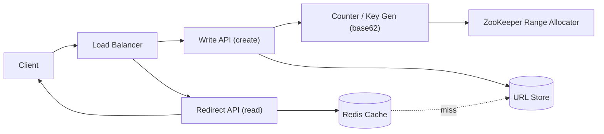

# URL Shortener

### 1. Requirements
**Functional**
- Create a short code for a long URL (optionally a custom alias).
- Redirect from a short code to the original long URL.
- Optional expiration / TTL on links.

**Non-functional**
- High availability and very low read latency (redirects are latency-critical, single-digit ms).
- Read-heavy: ~100:1 read:write ratio.
- Codes must be short (~7 chars), unique, and not trivially guessable.
- Scale: ~100M new URLs/day, ~10B redirects/day, durable storage for years.

### 2. Core Entities
- **URL** — short code → long URL mapping, plus owner and creation time.
- **Short Code** — base62 string (~7 chars) that uniquely identifies a URL.
- **Counter / ID Range** — monotonic number space used to mint codes.

### 3. API
```
POST /urls            -> { longUrl, customAlias?, ttl? } => { shortUrl }
GET  /{shortCode}     -> 302 redirect to longUrl
DELETE /urls/{code}   -> remove mapping (owner only)
```

### 4. High-Level Design


**Components**
- **Load Balancer** — spreads traffic across stateless API nodes. *Why here:* reads (redirects) outnumber writes by ~100:1, so the read path must scale horizontally independent of writes.
- **Write API / Redirect API** — separate create vs. resolve paths. *Why here:* the redirect path is latency-critical and read-heavy, so it is split out and cached aggressively while the write path can be slower.
- **Counter / Key Gen (base62)** — produces a unique monotonic number and encodes it to a 7-char base62 code. *Why here:* the entire problem is generating short, collision-free, non-guessable codes; base62 of a unique counter guarantees uniqueness without hash-collision retries.
- **ZooKeeper Range Allocator** — leases disjoint ID ranges (e.g. blocks of 1M) to each key-gen node. *Why here:* lets multiple stateless key-gen nodes mint IDs concurrently with zero coordination per request and no single global counter bottleneck.
- **URL Store (DynamoDB/Cassandra)** — durable short-code → long-URL mapping. *Why here:* access is a simple key lookup at massive scale, so a partitioned KV store fits better than a relational DB.
- **Redis Cache** — caches hot short-code lookups. *Why here:* a small fraction of links drive most clicks (power-law), so caching them keeps redirect latency in single-digit ms.

A create request hits the Write API, which asks the key-gen service for a unique number (drawn from a ZooKeeper-leased ID range), base62-encodes it into a short code, and persists the mapping in the URL store. A redirect request hits the Redirect API, which looks the code up in Redis, falls back to the DB on a miss, and returns a 301/302 to the long URL.

### 5. Deep Dives
- **Unique key generation at scale** — A central counter is a bottleneck and hash-based codes risk collisions. Each stateless key-gen node leases a disjoint ID range (e.g. 1M block) from ZooKeeper and mints IDs locally, then base62-encodes; this gives collision-free codes with no per-request coordination. Tradeoff: ranges can be lost on node crash (wasted IDs, harmless given the address space).
- **Non-guessable codes** — Sequential counters produce enumerable codes. Pass the counter through a Feistel cipher / bijective scramble before encoding so codes aren't predictable while remaining 1:1 and collision-free.
- **Read path scaling** — Redirects dominate, and clicks follow a power law. Cache hot codes in Redis with the DB as fallback, keeping p99 redirect latency low; use 301 vs 302 deliberately (302 keeps traffic flowing through your service for analytics, 301 offloads to the browser cache).
- **Storage choice** — Access is a simple key lookup at huge volume, so a partitioned KV/wide-column store (DynamoDB/Cassandra) sharded by short code scales better than a relational DB.

