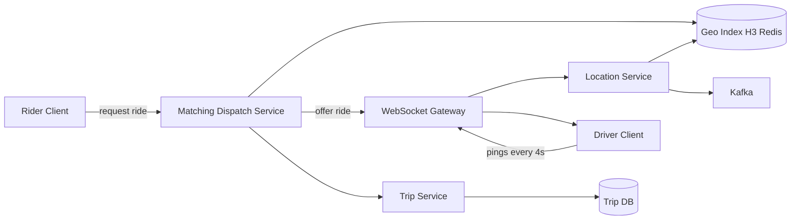

# Uber / Ride-Sharing

### 1. Requirements
**Functional**
- Drivers continuously report location.
- Riders request a ride and get matched to a nearby driver.
- Match via offer/accept handshake and track trip lifecycle.
- Real-time location/ETA updates to both parties.

**Non-functional**
- Low-latency matching (riders shouldn't wait).
- Handle a write-heavy stream of driver location pings at huge scale (~100K+ updates/sec).
- Durable, consistent trip state (money- and safety-critical).
- High availability for matching; the geo index can be in-memory/ephemeral.

### 2. Core Entities
- **Driver** — location, status (available/on-trip).
- **Rider** — requesting party with pickup location.
- **Trip** — lifecycle state: requested → accepted → ongoing → completed.
- **GeoCell** — H3 hexagon bucketing drivers by location.

### 3. API
```
POST /drivers/location -> {}            // high-frequency ping (or over WebSocket)
POST /rides -> {rideId, status}         // rider requests a ride
POST /rides/{id}/accept -> {tripId}     // driver accepts an offer
GET  /trips/{id} -> {status, driverLocation, eta}
```

### 4. High-Level Design


**Components**
- **WebSocket Gateway** — holds persistent connections for both driver pings and rider/driver push updates. *Why here:* ride-hailing is bidirectional and real-time (location updates, ride offers, ETA), which polling cannot meet at low latency.
- **Location Service** — ingests high-frequency driver pings and updates the geo index. *Why here:* drivers report location every few seconds (Uber's DISCO handles ~167K updates/sec), demanding a write-optimized ingestion path.
- **Geo Index (H3 in Redis)** — in-memory map of drivers bucketed by hexagonal H3 cell. *Why here:* H3 cell lookup is a pure function of lat/lng (no tree rebalancing under massive write load) and hexagons give uniform neighbor distances, so "nearby drivers" is a fast cell + ring scan.
- **Matching / Dispatch Service** — finds candidate drivers in the rider's cell and adjacent cells, then offers the ride. *Why here:* it shrinks millions of drivers to hundreds before any precise distance/ETA math, and manages the offer-accept handshake.
- **Trip Service + Trip DB** — persists trip lifecycle (requested, accepted, ongoing, completed). *Why here:* a trip is money-and-safety critical state that must be durable and transactional, unlike the ephemeral geo index.
- **Kafka** — streams location/trip events for surge pricing, analytics, and ETA models. *Why here:* downstream pricing and analytics need the firehose of events decoupled from the latency-critical matching path.

Drivers stream location pings over persistent WebSockets into the location service, which updates an H3-keyed in-memory geo index in Redis. When a rider requests a ride, the matching service queries the rider's H3 cell plus adjacent cells for candidate drivers, runs the offer/accept handshake over their WebSockets, and on accept the trip service writes durable trip state. Location and trip events also flow to Kafka for surge pricing, ETA models, and analytics off the latency-critical path.

### 5. Deep Dives
- **Geospatial index with H3** — finding nearby drivers among millions, under massive write load, needs more than a 2D tree that rebalances constantly. H3 cell IDs are a pure function of lat/lng, so updates are O(1) and "nearby" is a cell + ring scan; hexagons give uniform neighbor distances. Tradeoff: fixed cell resolution must be tuned (too coarse = too many candidates, too fine = misses).
- **WebSocket gateway + connection routing** — ride-hailing is bidirectional and real-time (pings in, offers out). Persistent sockets beat polling, but the sender and recipient are on different gateway nodes, so a registry maps user → gateway for routing offers. Tradeoff: managing millions of long-lived connections and sticky routing.
- **Offer/accept handshake under contention** — the same nearby driver may be offered to multiple riders. Dispatch offers sequentially with a short TTL lock per driver and falls back to the next candidate on decline/timeout. Tradeoff: serial offers add a little latency but prevent double-assignment.
- **Durable trip state vs. ephemeral geo data** — trips are money/safety-critical and need transactional, durable storage (Trip DB), while the constantly-churning geo index can live in memory and be rebuilt. Separating them lets each scale on its own characteristics. Tradeoff: two stores with different consistency guarantees to reason about.

