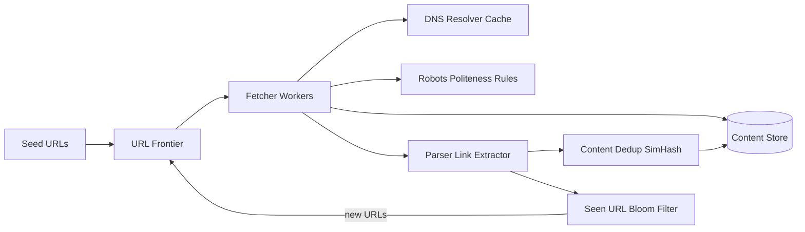

# Web Crawler

### 1. Requirements
**Functional**
- Start from seed URLs and discover new pages by extracting links.
- Download and store page content for downstream indexing.
- Respect robots.txt and per-domain politeness.
- Avoid re-crawling already-seen URLs and storing duplicate content.

**Non-functional**
- Massive scale: crawl billions of pages with high throughput.
- Politeness: never overload a single host (or get IP-banned).
- Fault tolerance and freshness (re-crawl pages periodically).
- Efficient dedup of both URLs and near-duplicate content (~29% of the web is duplicate).

### 2. Core Entities
- **URL** — a link to fetch, with priority and host.
- **Page/Content** — downloaded HTML stored durably.
- **Host** — domain with its robots rules and politeness delay.
- **SeenSet** — membership structure of already-queued URLs.

### 3. API
This is a system, not a public REST service; the "interfaces" are internal:
```
frontier.enqueue(url, priority)
frontier.dequeue() -> url           // respects per-host politeness ordering
fetcher.fetch(url) -> html
parser.extractLinks(html) -> urls[]
seen.contains(url) -> bool          // Bloom filter check
```

### 4. High-Level Design


**Components**
- **URL Frontier** — priority + per-host FIFO queues that order what to crawl next and enforce politeness delays. *Why here:* it is the heart of a crawler — it must prioritize important pages while never hammering a single domain.
- **Fetcher Workers** — download page HTML in parallel. *Why here:* throughput of billions of pages requires massive horizontal fetch concurrency.
- **DNS Resolver Cache** — resolves hostnames to IPs with a short-TTL local cache. *Why here:* DNS lookups are a per-fetch bottleneck, and caching cuts external queries ~99% for popular domains.
- **Robots / Politeness Rules** — checks robots.txt and applies per-domain rate limits. *Why here:* a crawler that ignores politeness gets IP-banned and is legally/ethically unacceptable at scale.
- **Parser / Link Extractor** — extracts outbound links and content from fetched pages. *Why here:* extracted links are the fuel that keeps the crawl expanding across the web graph.
- **Content Dedup (SimHash/MinHash)** — detects near-duplicate page content. *Why here:* ~29% of the web is duplicate, so skipping redundant content is essential to avoid wasting storage and bandwidth.
- **Seen-URL Bloom Filter** — approximate membership test to drop already-queued URLs. *Why here:* with billions of URLs, an exact set is too large in memory; a Bloom filter gives cheap dedup before re-queueing.
- **Content Store** — durable blob/store for raw pages feeding downstream indexing. *Why here:* crawled HTML must be persisted for the search-index pipeline that consumes it.

The URL frontier hands out priority- and politeness-ordered URLs to fetcher workers, which resolve DNS (cached), check robots rules, download the page, and store it. The parser extracts outbound links; content is run through SimHash dedup before storage, and extracted URLs are checked against a Bloom filter so only unseen ones re-enter the frontier. This loop expands the crawl across the web graph while throttling each host.

### 5. Deep Dives
- **URL frontier (prioritization + politeness)** — the heart of the crawler. It uses per-host FIFO queues fronted by priority queues so important pages are crawled sooner while a back-queue/host-mapping enforces a minimum delay per domain. Tradeoff: complex two-level queue structure, but it's the only way to maximize global throughput without hammering any single host.
- **Seen-URL dedup with a Bloom filter** — an exact set of billions of URLs won't fit in memory. A Bloom filter gives O(1) cheap membership at a small false-positive rate (occasionally drops a genuinely new URL). Tradeoff: false positives mean some pages never crawled, accepted for the huge memory savings.
- **Near-duplicate content detection (SimHash)** — exact-match hashing misses pages that differ by a timestamp or ad. SimHash/MinHash gives fingerprints whose Hamming distance flags near-duplicates, saving storage and bandwidth. Tradeoff: tuning the distance threshold trades false dedup against missed duplicates.
- **DNS caching and crawler traps** — DNS resolution is a per-fetch bottleneck, so a short-TTL local cache cuts external queries ~99%. Separately, the crawler must bound URL depth/length and detect infinite calendar-style link spaces to avoid traps. Tradeoff: aggressive trap heuristics may skip legitimate deep content.

