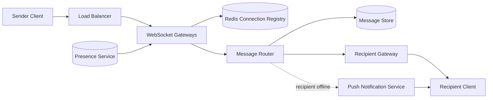

# WhatsApp / Chat

### 1. Requirements
**Functional**
- Send/receive 1:1 (and group) messages in real time.
- Deliver messages to offline recipients when they reconnect.
- Delivery and read receipts; presence (online/last-seen).

**Non-functional**
- Real-time, bidirectional, low-latency delivery.
- Durable until delivered; no message loss; ordered per conversation.
- High availability; support hundreds of millions of concurrent connections.
- Scale: tens of billions of messages/day, millions of live sockets per gateway tier.

### 2. Core Entities
- **Message** — sender, conversation ID, body, timestamp, status.
- **Conversation** — 1:1 or group; ordered message log.
- **User / Device** — identity and its current connection.
- **Connection** — userID/deviceID → gateway node holding the socket.

### 3. API
```
WS  /connect                       -> establish persistent socket
WS  send { convId, body, clientId } -> server acks + routes
WS  receive { msg }                 -> server-pushed message
POST /messages (REST fallback)      -> enqueue when no socket
GET  /conversations/{id}/messages   -> history sync
```

### 4. High-Level Design


**Components**
- **WebSocket Gateways** — hold millions of long-lived client connections. *Why here:* chat needs server-initiated, bidirectional, low-latency delivery, which request/response HTTP can't provide; persistent sockets are mandatory.
- **Redis Connection Registry** — maps userID/deviceID → which gateway node holds the socket. *Why here:* the recipient is connected to a *different* gateway than the sender, so the router must look up where to route — this mapping is the crux of real-time delivery.
- **Message Router** — routes between gateways, persists, and decides online vs. offline. *Why here:* it decouples the two sockets and centralizes delivery logic, including the offline fallback decision.
- **Message Store (Cassandra)** — durable per-conversation message log. *Why here:* messages must survive until delivered (and for history/sync), and the write pattern (append per chat) fits a wide-column store; doubles as the offline mailbox.
- **Presence Service** — tracks online/last-seen/typing via heartbeats. *Why here:* presence updates are extremely high-frequency, so they're kept off the message path on a separate pub/sub store to avoid swamping delivery.
- **Push Notification Service (APNs/FCM)** — delivers to offline recipients. *Why here:* when no socket exists, a mobile push wakes the app, which reconnects and pulls queued messages — the only way to reach a backgrounded device.

The sender's message arrives over a persistent WebSocket at a gateway. The message router looks up the recipient's gateway in the Redis connection registry, persists the message, and delivers it to that gateway's socket in real time. If the recipient has no live connection, the router falls back to a mobile push that wakes the app to reconnect and pull queued messages. Presence flows on a separate path.

### 5. Deep Dives
- **Connection routing** — The recipient is connected to a different gateway than the sender, so delivery requires looking up which gateway holds the socket. A Redis connection registry (userID/deviceID → gateway) is the crux; on disconnect the entry is cleared and offline fallback kicks in.
- **Offline delivery & ordering** — Undelivered messages persist in the message store (Cassandra, append-per-conversation) acting as a per-user mailbox; on reconnect the client syncs missed messages in order. Per-conversation sequence numbers give ordering and dedup.
- **Receipts** — Delivery/read receipts are themselves small messages routed back through the same path, updating message status; they must be idempotent.
- **Presence at scale** — Presence/typing updates are extremely high-frequency, so they're kept off the message path on a separate pub/sub service driven by heartbeats to avoid swamping delivery. Last-seen is best-effort.
