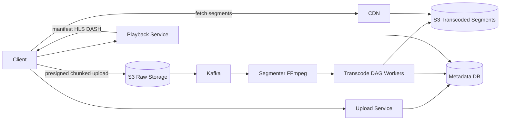

# YouTube / Video Streaming

### 1. Requirements
**Functional**
- Upload videos (large, multi-GB raw files).
- Transcode into multiple resolutions/codecs.
- Stream videos with adaptive bitrate playback.
- Browse/search and view video metadata.

**Non-functional**
- High availability for playback; uploads can tolerate slower/async processing.
- Low-latency, smooth streaming with minimal buffering; reads vastly outnumber writes.
- Durable storage of originals and renditions.
- Scale: ~hundreds of hours uploaded per minute, billions of daily playback requests; single source file fans out to dozens of renditions (144p–4K).

### 2. Core Entities
- **Video** — logical record: title, owner, processing status, duration.
- **RawUpload** — the original multi-GB file in blob storage.
- **Rendition/Segment** — a transcoded 2–6s chunk at a specific resolution/codec.
- **Manifest** — HLS/DASH playlist listing segment URLs per quality level.
- **User** — uploader/viewer.

### 3. API
```
POST /videos -> {videoId, uploadUrls[]}   // request presigned chunked upload URLs
POST /videos/{id}/complete -> {status}    // signal upload finished, trigger pipeline
GET  /videos/{id} -> {metadata, status}
GET  /videos/{id}/manifest -> HLS/DASH manifest (segment URLs per quality)
GET  /segments/{segmentId} -> bytes       // served via CDN
```

### 4. High-Level Design


**Components**
- **Upload Service / presigned upload to S3** — accepts chunked, resumable uploads of multi-GB raw files written directly to blob storage so the app servers never proxy video bytes. *Why here:* source files are huge and uploads flaky, so resumable client-to-blob transfer is the only way to ingest reliably at scale.
- **Kafka** — durably queues "new upload" events to decouple ingestion from the slow transcoding farm. *Why here:* transcoding takes minutes to hours, so the upload path must return immediately and process asynchronously.
- **Segmenter (FFmpeg)** — splits the raw file into short independent segments (a few seconds each). *Why here:* segmenting enables massive parallel transcoding and is the unit that adaptive-bitrate players switch between mid-playback.
- **Transcode DAG Workers** — run a directed-acyclic-graph of parallel jobs producing every resolution/codec variant (144p-4K; H.264/VP9/AV1). *Why here:* one source must become dozens of device- and bandwidth-specific renditions, which is the dominant compute cost of the system.
- **Transcoded Segments blob store** — stores all output renditions plus generated manifests. *Why here:* it is the read-optimized origin the CDN pulls from for billions of playback requests.
- **Metadata DB** — holds video records, processing status, and manifest references. *Why here:* playback needs a fast lookup of which renditions/segments exist before streaming begins.
- **Playback Service** — returns the HLS/DASH manifest listing segment URLs per quality level. *Why here:* the manifest is what lets the client player adapt bitrate to live network conditions without re-requesting from the server.
- **CDN** — caches popular segments at edge POPs close to viewers. *Why here:* video is read-heavy and latency-sensitive, so origin-offload at the edge is what makes global streaming affordable and smooth.

The client uploads raw video in resumable chunks directly to S3 via presigned URLs while registering metadata through the upload service. Completion publishes a Kafka event that triggers the segmenter to split the file into short segments, which a DAG of transcode workers fans out into every resolution/codec rendition stored back in S3 along with generated manifests. On playback the client fetches an HLS/DASH manifest from the playback service and then streams individual segments from the CDN, switching quality per segment as bandwidth changes.

### 5. Deep Dives
- **Transcoding pipeline as a DAG** — one source must become dozens of renditions, the dominant compute cost. Splitting into independent segments first lets thousands of encode jobs run in parallel across a worker farm; modeling it as a DAG captures dependencies (segment → per-rendition encode → packaging). Tradeoff: more orchestration complexity, but massively parallel and resumable on partial failure.
- **Adaptive bitrate streaming (HLS/DASH)** — the manifest lists segment URLs per quality level so the client player measures throughput and picks the next segment's bitrate. This avoids server-side session state and lets playback adapt seamlessly to fluctuating networks. Tradeoff: client complexity and many small objects to manage, but smooth playback without rebuffering.
- **Resumable direct-to-blob upload** — multi-GB uploads over flaky connections can't proxy through app servers. Presigned chunked uploads write straight to S3 so the app tier never handles video bytes and partial uploads can resume. Tradeoff: client must manage chunking/retries.
- **CDN origin offload** — video is read-heavy and latency-sensitive; caching popular segments at edge POPs is what makes global streaming affordable. Tradeoff: cache invalidation and cost for long-tail content that rarely hits cache.

